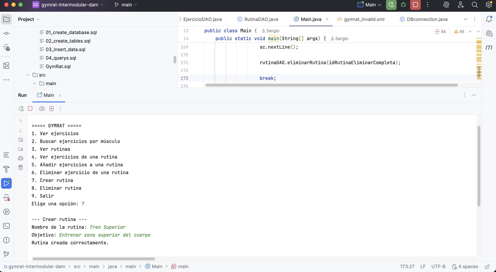
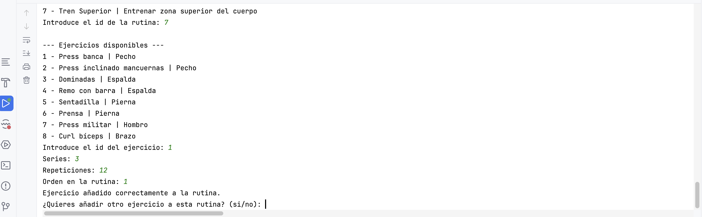

## Portfolio

### Proyecto: GymRat

Aplicación de consola para gestionar rutinas de entrenamiento.

Incluye:

- Gestión de ejercicios
- Creación de rutinas
- Relación entre ejercicios y rutinas
- Base de datos MySQL

Repositorio:
https://github.com/sergiohazgon/gymrat-intermodular-dam

Capturas:

### Aprendizaje:

Este proyecto me ha permitido adquirir una visión completa del desarrollo de aplicaciones conectadas a bases de datos, abarcando todo el proceso desde el diseño inicial hasta la implementación final. 

He trabajado aspectos clave que se utilizan en entornos profesionales, como la organización del código en capas (DAO, model, etc.), la conexión con bases de datos mediante JDBC, el diseño de estructuras relacionales y la gestión de proyectos con herramientas como Maven y Git.

Además, me ha servido como una primera aproximación a cómo se desarrollan aplicaciones en un contexto real de empresa, donde es importante no solo que el código funcione, sino que sea mantenible, estructurado y fácil de entender para otros desarrolladores.