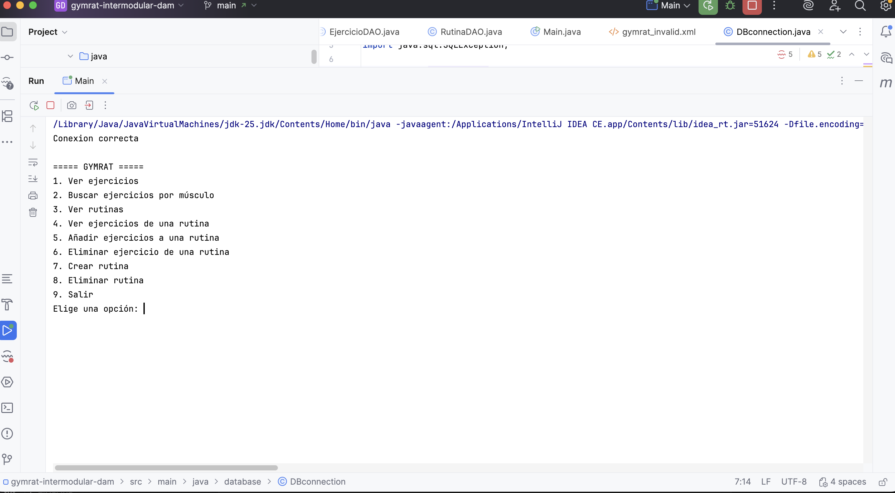
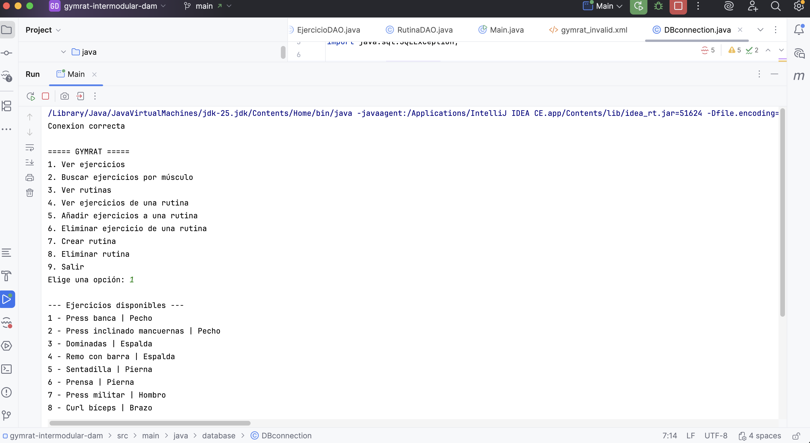

# Informe Técnico - GymRat

## ¿En qué equipo se ejecuta?

En PC del usuario, sin necesidad de servidor ni nada especial. GymRat es una
app de consola para uso personal, así que con cualquier portátil o sobremesa
normal es suficiente.

## ¿Qué sistema operativo necesita?

Se ha desarrollado y probado en macOS. También funciona en Linux y Windows
siempre que tengas Java y MySQL instalados. 

## ¿Qué recursos necesita?

- CPU mínima: Procesador de 2 núcleos (Intel i3 o equivalente)
- CPU recomendada: Procesador de 4 núcleos (Intel i5 o equivalente)
- RAM mínima: 4 GB
- RAM recomendada: 8 GB
- Almacenamiento: 500 MB libres
- Periféricos: teclado y pantalla

## ¿Cómo se instala?

**1. Instalar Java (JDK 17 o superior)**

Descárgalo desde la página de Oracle e instálalo. Para comprobar que está bien en la terminal:

bash
java -version


**2. Instalar MySQL**

Descárgalo desde https://dev.mysql.com/downloads/mysql/ y durante la instalación
pon una contraseña al usuario `root` y no la pierdas.

**3. Crear la base de datos**

- Ir a phpMyAdmin
- Click en Importar
- Subir GymRat.sql

Esto crea la base de datos con todas las tablas y los datos de ejemplo.

**4. Configurar la conexión**

Abre `DBconnection.java` y pon tu contraseña de MySQL:

```java
private static final String URL = "jdbc:mysql://localhost:3306/gymrat";
private static final String USER = "root";
private static final String PASSWORD = "tu_contraseña_o_vacía";
```

**5. Añadir el driver JDBC**

Al ser proyecto Maven he añadido la dependencia al pom.xml que puedes descargar desde https://mvnrepository.com/artifact/mysql/mysql-connector-java, una vez copiada actualiza para que se quede integrado en el proyecto. 

Otra forma es desde IntelliJ: `File → Project Structure → Libraries → +` y añade el archivo
`mysql-connector.jar`. Descárgalo desde https://dev.mysql.com/downloads/connector/j/

## ¿Cómo se ejecuta?

Desde IntelliJ, abriendo el proyecto y ejecutando `Main.java`. Antes de hacerlo
asegúrate de que MySQL está corriendo, si no la conexión fallará.

## ¿Cómo se mantiene?

GymRat es una aplicación ligera, por lo que el mantenimiento necesario es básico.

### Actualizaciones

Se recomienda mantener actualizado:

- Java (JDK)
- MySQL
- Driver JDBC (mysql-connector)

Esto garantiza compatibilidad y seguridad.

### Copias de seguridad

Antes de realizar cambios importantes en la base de datos, es recomendable hacer una copia de seguridad fuera del repositorio.

bash
cd ~/Documents/backups
mysqldump -u root -p gymrat > gymrat_backup.sql

## ¿Cómo se protege?

Al ser una app local sin conexión a internet ni usuarios externos, el riesgo es
bajo. Lo mínimo es no subir `DBconnection.java` con la contraseña real a GitHub
(usar `.gitignore` o poner una contraseña de ejemplo) y hacer copias de seguridad
de la base de datos periódicamente.

## Evidencias




## Estructura de carpetas del proyecto

El proyecto está organizado en distintas carpetas para separar código, documentación, scripts SQL y recursos del sistema.


gymrat-intermodular-dam/
├── docs/
│   ├── bbdd/
│   ├── empleabilidad/
│   ├── scrum/
│   ├── sistemas/
│   └── xml/
├── sql/
├── src/
│   └── main/
│       └── java/
│           ├── dao/
│           ├── database/
│           ├── main/
│           └── model/
├── pom.xml
└── README.md

## Esquema del sistema

A continuación se muestra un esquema simple del funcionamiento del sistema:


El usuario interactúa con la aplicación Java mediante consola. La aplicación gestiona la lógica del sistema y se conecta a la base de datos MySQL utilizando JDBC para almacenar y recuperar la información.